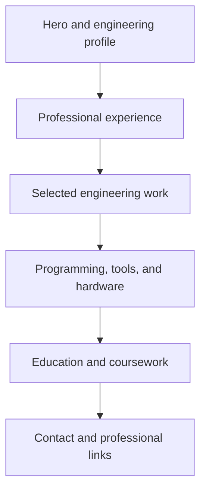

<div align="center">

# Jacob Potts — Engineering Portfolio

### Embedded Software · Linux · Hardware Validation · Automated Testing

[](https://jacob-potts.github.io)
[](https://pages.github.com/)
[](#local-development)
[](#design-system)

**A fast, responsive portfolio showcasing computer engineering experience at the intersection of software and physical hardware.**

[View Portfolio](https://jacob-potts.github.io) · [View Resume](resume.pdf) · [Report an Issue](https://github.com/Jacob-Potts/Jacob-Potts.github.io/issues)

</div>

---

## About the portfolio

This site presents my engineering experience, technical skills, education, and selected academic work in a focused, recruiter-friendly format. It is designed around my primary interests: **embedded software, embedded Linux, hardware–software integration, automated test systems, and hardware validation**.

The portfolio highlights work completed as an **Embedded Software Engineering Intern at RAVE Aerospace**, including:

- Automated acceptance and production-test software with USB-C configuration detection
- Embedded Linux hardware abstraction layer (HAL) functionality
- Real-time Bluetooth connection telemetry in a responsive qualification-test GUI
- Bidirectional iPerf network validation and managed-switch configuration
- Hardware identification, diagnostics, GPIO data, and DHCP configuration management
- Burn-in rack troubleshooting that identified **7 of 10 faulty cables**

## Site highlights

| Area | Implementation |
|---|---|
| **Engineering-first presentation** | Experience and technical outcomes take priority over generic biography content. |
| **Responsive interface** | Grid layouts collapse cleanly for tablets and phones, with mobile-aware navigation and controls. |
| **Distinct visual system** | Warm technical-paper palette, grid background, monospace labels, strong typography, and engineering status elements. |
| **Accessible structure** | Semantic headings, readable contrast, descriptive metadata, and keyboard-accessible native links. |
| **Fast delivery** | Pure HTML and CSS with no framework, package manager, runtime, or build step. |
| **Integrated resume** | The full resume opens directly from the hero section and can be downloaded from the repository. |
| **Simple deployment** | Designed for direct hosting through GitHub Pages. |

## Portfolio sections



1. **Hero** — engineering focus, location, graduation date, resume, and primary call to action
2. **Experience** — technical accomplishments from RAVE Aerospace and work history
3. **Selected Work** — circuit design, digital logic, computer organization, assembly, and CAD
4. **Technical Skills** — programming languages, engineering tools, Linux, test equipment, and hardware interfaces
5. **Education** — blended B.S./M.S. Computer Engineering program at California State University, Fullerton
6. **Contact** — email, phone, and GitHub access

## Technical profile represented

| Category | Technologies and experience |
|---|---|
| **Programming** | C, C++, Bash, Python, VHDL, MATLAB, Verse, QML |
| **Platforms & tools** | Linux, Git, GitHub, SVN, Bitbucket, VS Code, Minicom, Qt, Questa, Multisim |
| **Embedded & hardware** | GPIO, EEPROM, device identification, watchdog status, hardware revisions, voltage and temperature telemetry |
| **Test & validation** | Automated acceptance testing, production verification, USB-C power testing, iPerf, qualification GUIs, burn-in systems |
| **Lab equipment** | Oscilloscopes, multimeters, function generators, DC power supplies, breadboards, managed network switches |

## Project structure

```text
Jacob-Potts.github.io/
├── index.html              # Semantic content and portfolio sections
├── style.css               # Visual system, layouts, and responsive rules
├── resume.pdf              # Downloadable engineering resume
└── README.md               # Repository documentation
```

## Local development

No installation or build process is required.

```bash
git clone https://github.com/Jacob-Potts/Jacob-Potts.github.io.git
cd Jacob-Potts.github.io
```

Open `index.html` directly in a browser, or start a small local server:

```bash
python -m http.server 8000
```

Then visit [http://localhost:8000](http://localhost:8000).

## Deploying with GitHub Pages

1. Create or open a repository named `Jacob-Potts.github.io`.
2. Place `index.html`, `style.css`, `resume.pdf`, and `README.md` in the repository root.
3. Commit and push the files to the default branch.
4. In **Settings → Pages**, select **Deploy from a branch**.
5. Choose the default branch and the `/ (root)` folder, then save.

GitHub Pages will publish the site at `https://Jacob-Potts.github.io` after the deployment completes.

## Design system

The interface uses a compact set of reusable CSS variables, making the visual identity easy to change without rewriting individual components.

```css
:root {
  --ink: #10231f;
  --paper: #f4f1e9;
  --card: #fffdf7;
  --accent: #e6633d;
  --green: #1f4d41;
}
```

The layout combines:

- A subtle 32 px technical grid
- A sticky, translucent navigation bar
- Editorial display typography paired with monospace technical labels
- Reusable cards, status indicators, section grids, and responsive breakpoints
- A mobile-first fallback for narrow screens below 800 px and 520 px

## Customization guide

### Update resume content

Edit the matching section in `index.html`. Experience bullets are inside the `<section id="experience">` element, while technologies are inside `<section id="skills">`.

### Replace the resume

Export the latest resume as PDF, name it `resume.pdf`, and replace the existing file. Keeping the filename unchanged prevents broken links.

### Add a project

Duplicate a `.card` article inside the project grid and update its number, title, description, and technology label.

```html
<article class="card">
  <span>04</span>
  <h3>Project name</h3>
  <p>Problem, engineering approach, and measurable outcome.</p>
  <small>Technology · Hardware · Tool</small>
</article>
```

### Change the color palette

Update the variables at the beginning of `style.css`; all major surfaces and components inherit from them.

## Roadmap

- [x] Responsive professional portfolio
- [x] Engineering experience and education
- [x] Integrated resume access
- [x] Mobile and tablet layouts
- [ ] Detailed project case studies with diagrams and results
- [ ] Project photography and hardware demonstrations
- [ ] LinkedIn profile integration
- [ ] Open Graph preview image and expanded social metadata
- [ ] Accessibility and performance audit

## Contact

**Jacob J. Potts**  
Computer Engineering — California State University, Fullerton  
Corona, California

- Email: [JacobJamesPotts@gmail.com](mailto:JacobJamesPotts@gmail.com)
- GitHub: [github.com/Jacob-Potts](https://github.com/Jacob-Potts)
- Portfolio: [Jacob-Potts.github.io](https://Jacob-Potts.github.io)

---

<div align="center">

Built to communicate engineering work clearly—from source code to real hardware.

© 2026 Jacob J. Potts

</div>
